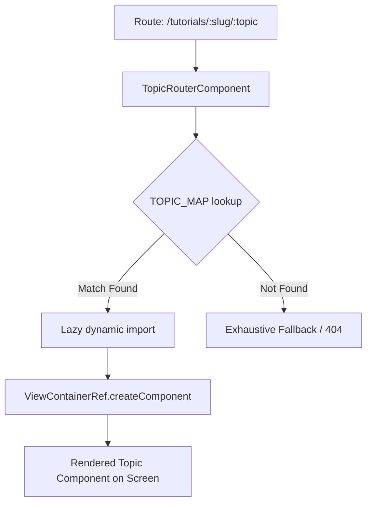

# JavaIQ Project Analysis & Architectural Report
> **Audit Date:** May 2026  
> **System Architecture:** Angular 21 Standalone + Ionic 8 + Capacitor 7 + Firebase  
> **Repository Scale:** 130+ Interactive Tutorial Topics, Spanning 8 Modules  

---

## 1. Project Stats & Core Technology Matrix

JavaIQ is a premium, cross-platform mobile and web application built using modern web standards to prepare candidates for advanced Java interviews. The codebase utilizes state-of-the-art Angular patterns combined with a mobile-optimized Ionic framework shell.

| Layer / Concern | Tech Choice | Version / Standard | Strategic Advantage |
| :--- | :--- | :--- | :--- |
| **App Core** | Angular | `^21.0.0` | Standalone components, tree-shakeable routing, `inject()` patterns. |
| **Change Detection** | `OnPush` | Non-negotiable | Minimizes CD runs; components only re-render on signal changes or input reference modifications. |
| **State Management** | Angular Signals | Core reactive primitives | Zero-overhead, high-performance reactivity replacing RxJS `BehaviorSubject` boilplate. |
| **Mobile Shell** | Ionic Angular | `^8.7.17` | Premium UI components, hardware-accelerated animations, native-like navigation stacks. |
| **Mobile Core** | Capacitor | `^7.4.4` | Native iOS/Android bridging, standard plugin APIs, file:// URL scheme compatibility. |
| **Backend Layer** | Firebase | `^12.8.0` | Realtime Firestore sync, offline persistence, passwordless & Google SSO authentication. |
| **Syntax Highlighting** | PrismJS | `^1.30.0` | Lightweight syntax parser, fully tree-shakeable. |
| **Unit Testing** | Vitest | `^4.0.8` | Vite-native fast execution runner replacing Karma. |
| **End-to-End Testing**| Playwright | `^1.58.2` | Headed, headless, and UI-mode real browser user flow validations. |

---

## 2. Directory Layout & Feature-Slice Architecture

The codebase implements a **feature-slice vertical design pattern**, separating vertical domain areas (tutorials, assessments, mock interviews) from cross-cutting app-wide singletons (`core/`) and reusable presentational elements (`shared/`).

```text
src/app/
├── app.config.ts                      # Core Angular providers (Firebase, Ionic, HashLocation, preloading)
├── app.routes.ts                      # Master routing table with lazy loading
├── app.component.ts                   # Shell component (manages desktop split-pane & mobile bottom nav)
│
├── core/                              # Cross-cutting singletons (always providedIn: 'root')
│   ├── auth.service.ts                # Platform-aware authentication logic
│   ├── gamification.service.ts        # XP calculation, level-ups, streaks, freezes
│   ├── offline-cache.service.ts       # LocalStorage network bypass helper
│   ├── connectivity.service.ts        # Real-time online/offline detector (Wifi/Cellular)
│   └── lang.service.ts                # Internationalization runtime manager
│
├── features/                          # Vertical feature slices (never import from other feature slices)
│   ├── tutorials/                     # Dynamic curriculum player & syllabus browser
│   │   ├── topics/                    # 130+ highly-stylized modular topic components
│   │   ├── tutorial-list.component.ts # Course dashboard
│   │   ├── tutorial-detail.component.ts# Module curriculum view
│   │   └── topic-router.component.ts  # Dynamic code-splitting component injector
│   ├── assessments/                   # Quiz state engine & performance tracking
│   ├── coding-questions/              # Interview coding sandbox exercises
│   ├── mock-interview/                # Behavioral & system design prep flows
│   └── progress/                      # Detailed candidate progress dashboards
│
├── shared/                            # Stateless reusable presentational widgets
│   ├── code-block.component.ts        # Syntax highlighter wrapper
│   ├── tutorial-layout.component.ts   # Banner, badge, and grid frame wrapper
│   └── icon.component.ts              # Lightweight vector icon library
│
└── data/                              # Static schemas & offline registries
    ├── course-topics.const.ts         # Topic navigation registry (slugs & durations)
    └── tutorials/                     # Standard authoring lesson JSON templates
```

---

## 3. Core Structural Design Patterns

### A. The Dynamic Code-Splitting Topic Router
To avoid registering hundreds of distinct routes inside `app.routes.ts` (which would bloat the router bundle and slow down startup), the app utilizes a highly optimized **Dynamic Code-Splitting Router Pattern** inside `src/app/features/tutorials/topic-router.component.ts`.



- **Dynamic Lazy Loading:** Inside `topic-router.component.ts`, a multi-dimensional dictionary mapping `[courseSlug][topicSlug]` holds promises to lazy-loaded files:
  ```typescript
  'core-java': {
    'jvm-basics': () => import('./topics/jvm-basics.component').then(m => m.JvmBasicsComponent),
    // ...
  }
  ```
- **Automatic Heap Garbage Collection:** The router utilizes `this.nativeAdService.destroyAll()` to clear old native ad views and executes `this.outlet.clear()` to release DOM and memory nodes of the outgoing chapter before loading the new one.
- **Translucent Navigation Overlays:** Supports high-performance sliding transitions on mobile viewports with hash navigation (`withHashLocation()` required for native platform `file://` compatibility).

### B. Progress Registry & Stable Key Hashing
Candidate progress is represented inside the `DataService` as a highly performant, reactive `Set` using standard key hashing:
* **Key Format:** `[courseSlug]::[topicSlug]` (e.g., `core-java::string-pool`)
* **State Primitive:** `completedTopicIds = signal<Set<string>>(new Set());`
* **Performance Benefit:** Resolving topic completion is an $O(1)$ set lookup rather than array traversals. Updates are atomic and trigger instant UI updates across independent sub-widgets.
* **Dual Persistence Sync:** An Angular `effect()` automatically mirrors updates to a local Cache, while concurrently queuing transactional uploads to Firestore `users/{uid}.completedTopicIds`.

---

## 4. Ascension Gamification Engine (`GamificationService`)

The engagement and retention loops are inspired by gamification leaders (e.g., Duolingo) and run entirely on client-side reactive Signals synced to Firestore:

### A. Logarithmic Level Scaling
XP points translate into levels using a custom quadratic-to-logarithmic curve:
$$\text{Level} = \left\lfloor\sqrt{\frac{\text{XP}}{100}}\right\rfloor + 1$$

* **Level 1:** $0\text{ XP}$
* **Level 2:** $100\text{ XP}$
* **Level 3:** $400\text{ XP}$
* **Level 5:** $1600\text{ XP}$
* **Level 10:** $8100\text{ XP}$

### B. Daily Streak Freeze Mechanic
* **Free Tier:** 1 streak freeze allowed per week (auto-refreshed on ISO week change).
* **Pro Tier:** 7 freezes allowed per week.
* **Auto-Recovery:** If a user returns after a 2-day gap, the service checks if `streakFreezes > 0`. If yes, it auto-deducts a freeze and preserves the multi-day streak, maintaining user motivation.

---

## 5. Curriculum Content Quality Analysis

The application covers an incredibly rich collection of **130+ distinct topics**, grouped logically by course tags:

```text
├── core-java (42 topics)
│   ├── foundations (data-types, variables-casting, operators, control-flow, loops, methods, arrays)
│   ├── strings & pool (strings, string-pool, wrapper-classes)
│   ├── oop (oop-classes, inheritance, polymorphism, abstraction, encapsulation, enums, final-static, nested-classes)
│   ├── object internals (object-class, equals-hashcode, cloning, immutable-classes)
│   ├── exception handling (exceptions, try-resources)
│   ├── collections (collections-list, collections-map, collections-queue, iterator-iterable, comparable-comparator)
│   ├── functional java (generics, functional-interfaces, lambdas, method-references, streams, optional)
│   └── platform & dates (date-time, annotations, var-type-inference, pattern-matching, text-blocks, records-sealed, serialization, java-memory-model, garbage-collection, reflection, io-files)
│
├── spring-framework (12 topics: spring-ioc, spring-di, spring-beans, spring-aop, spring-mvc, spring-rest, spring-data, spring-security, spring-config, spring-testing, spring-events, spring-caching)
│
├── spring-boot (18 topics: sb-auto-config, sb-starters, sb-properties, sb-devtools, sb-actuator, sb-logging, sb-rest-api, sb-validation, sb-exception, sb-data-jpa, sb-security, sb-testing, sb-profiles, sb-docker, sb-caching, sb-scheduling, sb-events, sb-deploy)
│
├── hibernate (10 topics: hib-orm, hib-entities, hib-relations, hib-jpql, hib-criteria, hib-caching, hib-transactions, hib-performance, hib-inheritance, hib-auditing)
│
├── microservices (14 topics: ms-intro, ms-discovery, ms-gateway, ms-config, ms-circuit, ms-loadbalance, ms-communication, ms-events, ms-saga, ms-cqrs, ms-tracing, ms-docker, ms-k8s, ms-security)
│
├── multithreading & concurrency (8 topics: mt-threads, mt-sync, mt-executors, mt-future, mt-collections, mt-locks, mt-atomic, mt-virtual)
│
├── modern-java (5 topics: mj-text-blocks, mj-records-sealed, mj-pattern-matching, mj-switch-expr, mj-virtual-threads)
│
└── design-patterns (21 Creational, Structural, and Behavioral topics)
```

---

## 6. Architectural Recommendations

### Recommendation 1: Streamline Curricular Registry Schemas
**Issue:** The curriculum metadata lives in three parallel arrays:
1. `data/course-topics.const.ts` (`CourseEntry[]`)
2. `src/app/features/tutorials/tutorial-list.component.ts` (`courses: TutorialCourse[]`)
3. `src/app/features/tutorials/tutorial-detail.component.ts` (`courses: Record<string, CourseData>`)

**Action:** Consolidate these static descriptions into a single unified JSON schema or service provider under `src/app/data/tutorials/master-registry.ts` to prevent desynchronization when adding new topics.

### Recommendation 2: Introduce LocalStorage Deflation
**Issue:** With 130+ topics, storing detailed text representations, bookmarks, and historical quiz attempts as raw JSON in LocalStorage could approach standard browser quota limits ($5\text{MB}$).  
**Action:** Implement lightweight LZW or string compression for local caching, or rely exclusively on Firestore reactive sync for history logs.

### Recommendation 3: Standardize the Interactive Widget Layer
**Issue:** The audit plan (`core-java-content-improvement-plan.md`) highlights that older topic visualizers are button-driven (demo only).  
**Action:** Transition all visualizers to support "Try-it-yourself" input forms using standard Angular Signals, enabling live code or scenario execution on-device.
